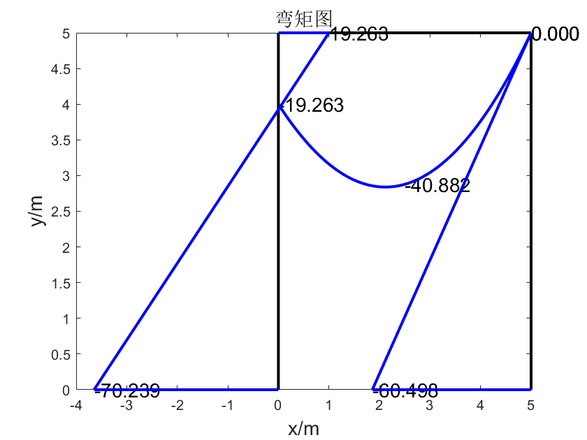
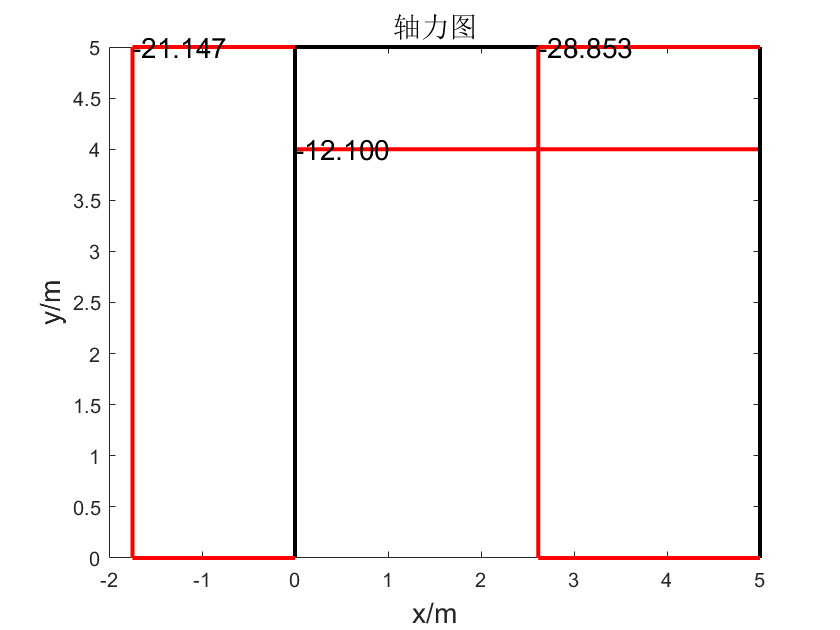
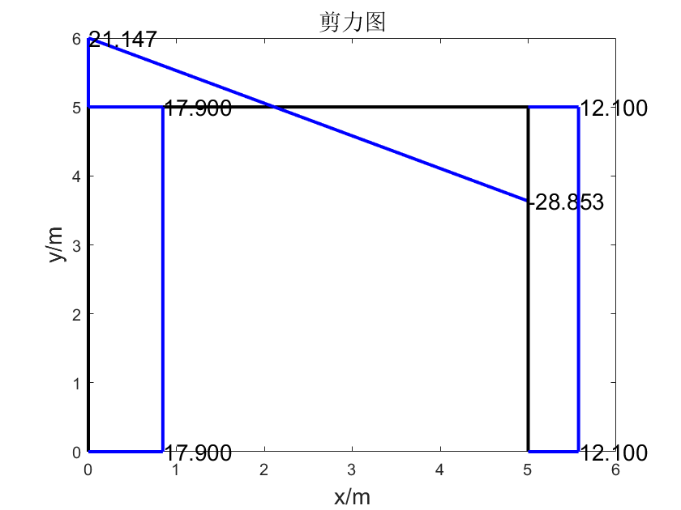

# Computational Mechanics Final project

> Implement a simple 2D structure mechanics sovler using matrix displacement method.

## Files

### Utility

- `transform_matrix.m`: generate a rotation matrix given the rotation angle $\alpha$
- `fix_end_force.m`: generate fix end force based on different forces
- `inputfile.m`: load inputdata from test files `test1.txt`, `test2.txt`
- `outputfile.m`: export computational results to the output file `output1.txt` `output2.txt`

### Plot

- `FNplot.m`: plot the axial force of the truss
- `FQplot.m`: plot the shear force of the truss
- `Mplot.m`: plot the moment of the truss

### Computation

- `element_stiff_mat.m`: generate a $6\times 6$element stiff matrix
- `element_vector_process.m`: process the element direction vector, return its zeros part and non-zeros part seperately
- `matrix_displacement.m`: compute the force based on the matrix displacement method

## Figure

